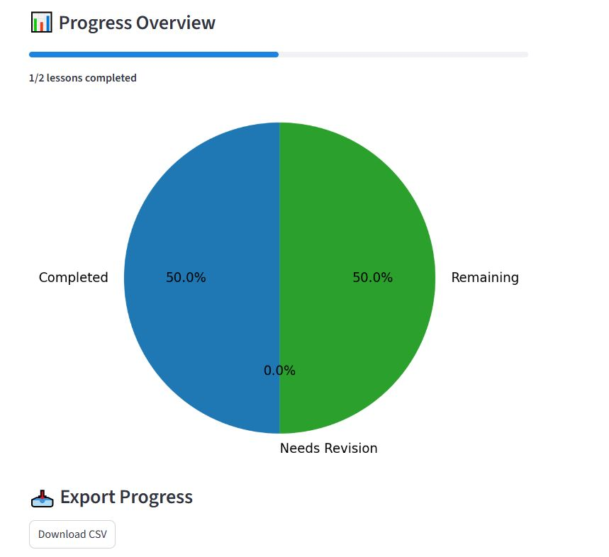

# Learning Dashboard
A Streamlit web app to track learning progress and revision

## Features include
- Add a course and paste lessons (one per line)
- Mark lessons as **Completed** or **Needs Revision**
- Add quick notes for what clicked
- See progress via a pie chart + progress bar
- Export data to CSV
  
## How to run it
- pip install streamlit
- streamlit run learning_dashboard.py
  
## Screenshots

### Course & Lessons

### Checklist and Notes

### Progress Pie chart

